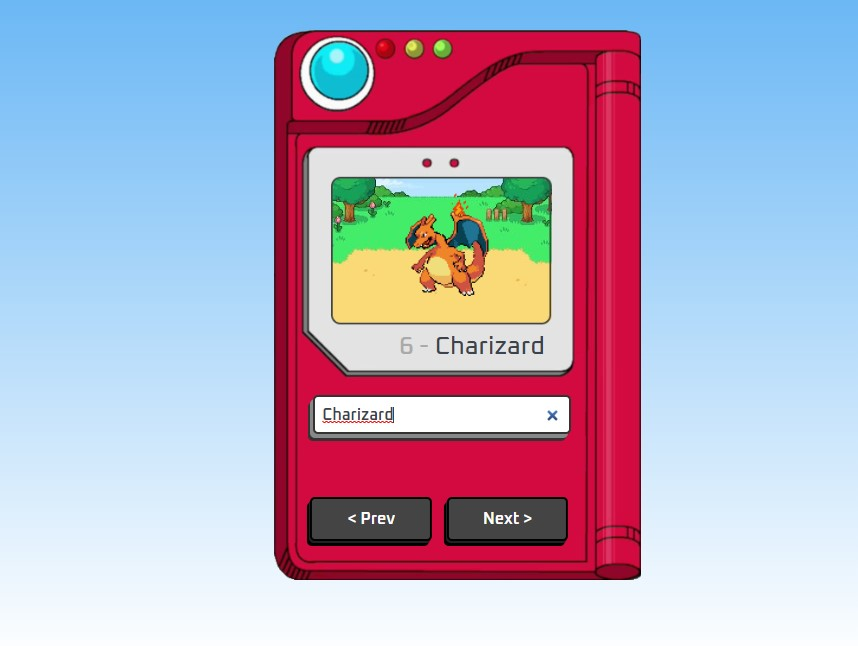

# Pokedex - React App

Este projeto é uma adaptação em ReactJS do projeto [pokedex](https://github.com/manualdodev/pokedex).

## Sumário

- [Visão Geral](#visão-geral)
  - [Screenshot](#screenshot)
  - [Links](#links)
- [Meu processo](#meu-processo)
  - [Construção](#construção)
  - [Aprendizado](#aprendizado)
  - [Recursos](#recursos)
- [Autor](#autor)

## Visão Geral

### Screenshot

### Links

- Projeto: https://github.com/FelipeGodoy96/Pokedex-React
- Live Site URL: https://felipegodoy96.github.io/Pokedex-React/

## Meu processo

### Construção

- NPX Create React App
- ES6 JS

### Aprendizado

Durante o desenvolvimento desse projeto pude compreender o funcionamento de React Hooks como useEffect e useState e como aplicá-los em uma aplicação React como também o uso de props para componentes filho.

### Recursos

- [Create React App](https://github.com/facebook/create-react-app)
- [React GH-Pages](https://github.com/gitname/react-gh-pages)

## Autor

- GitHub - [Felipe Godoy](https://github.com/FelipeGodoy96)
- Instagram - [@Godoy.code](https://www.instagram.com/godoy.code/)
